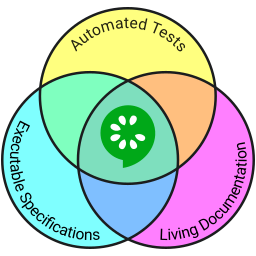

# 

Cucumber is a tool that supports [Behaviour-Driven Development
(BDD)](https://cucumber.io/blog/2017/05/15/intro-to-bdd-and-tdd) - a software
development process that aims to enhance software quality and reduce
maintenance costs.

Cucumber executes *executable specifications* written in [plain language](https://github.com/cucumber/cucumber/blob/master/docs/gherkin.md)
and produces reports indicating whether the software behaves according to the
specification or not.

Cucumber reduces the effort to keep requirements specifications, tests and documentation
in sync - with Cucumber they are all the same documents - a single source of truth
for everyone on the team.

These executable specifications are meant to be cross-project.

To add them to your project issue the following git commands:
`git subtree add --prefix test/cucumber https://github.com/HBOCodeLabs/living-documentation.git master --squash`

To update(choosing the appropriate version/branch/commit):
`git subtree pull --prefix test/cucumber https://github.com/HBOCodeLabs/living-documentation.git master --squash`

notes:
- Cucumber requires node 6.10.0 or higher
    - `npm i --save-dev chai@latest`
    - `npm i --save-dev cucumber@latest`
    - `npm i cucumber-pretty --save-dev`
- Run all tests
    - `./node_modules/.bin/cucumber-js test/cucumber/features/**/*.feature -f node_modules/cucumber-pretty`
- Run @tagged tests
    - https://github.com/cucumber/cucumber/wiki/Tags
    - `./node_modules/.bin/cucumber-js test/cucumber/features/**/*.feature -f node_modules/cucumber-pretty ==tags @api`
- Run named tests (regex)
    - `./node_modules/.bin/cucumber-js test/cucumber/features/**/*.feature -f node_modules/cucumber-pretty --name "see a sign link"`    
  
